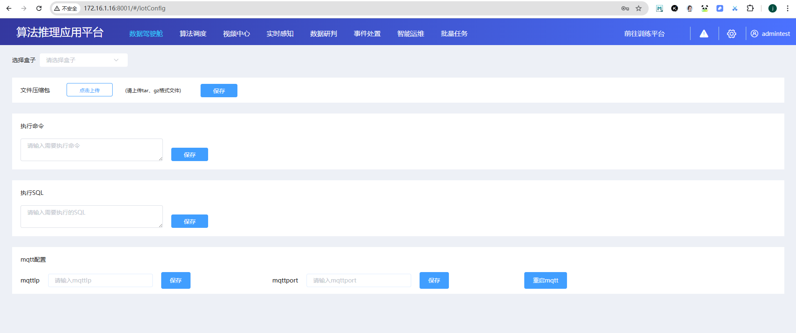

# 鸿羽IOT中台应用系统 IOT盒子运维管理方案设计 & UE界面原型

## [20260407] 当前界面设计 & 存在问题

> [20260407] 当前鸿羽IOT中台-IOT盒子运维页面存在问题：
> 操作过程黑箱、状态反馈缺失、业务逻辑不闭环、运维使用门槛较高。

## [20260409] 新方案

### 新方案仿真界面 & 设计思路
新方案将原有分散的运维能力整合为三类核心功能页面：
- 202604_IOT模式_中台升级盒子界面.html
- 202604_IOT模式_中台远程执行盒子界面.html
- 202604_IOT模式_中台更改盒子MQTT配置界面.html

实际落地时，以上三个功能页面将作为**标签页**，统一集成在：
**鸿羽IOT中台IP:8001/#/iotConfig**
即：鸿羽IOT中台应用系统 - IOT盒子运维管理页面。

运维人员通过该**唯一入口**，即可对当前中台已发现的所有IOT盒子执行集中化运维管理。
整套仿真界面已完整表达中台对IOT盒子的全部运维管理能力与方案设计思路。

---

# 页面设计说明（面向研发、产品）

本目录用于向研发、产品相关人员说明鸿羽IOT中台应用系统中盒子运维页面的核心设计思路、访问规则及安全考量，确保团队对页面定位与使用边界达成共识。

## 一、页面定位与访问形态
本页面为鸿羽IOT中台系统中**IOT盒子运维专属直访页面**，核心特征如下：
- 无显性入口：页面不挂载于中台主页面及其他业务页面的导航菜单、按钮或链接中。
- 唯一直访方式：仅可通过预设的特定URL直接访问，系统内无其他可跳转至此页面的路径。

## 二、设计初衷与业务场景
将页面设计为独立直访形态，核心目的是实现**专业运维操作与普通业务操作的隐性隔离**。

本页面面向鸿羽IOT系统**专业运维人员**，作为可视化运维控制台使用。
核心能力包括：通过中台依托MQTT公网消息代理，对已注册终端盒子进行全生命周期运维管理，涵盖盒子远程升级、Shell/SQL远程执行、核心配置下发与设备状态监控。

采用无显性入口设计，可避免普通操作员、管理员等非专业用户感知或误进入该页面，从访问层面降低误操作风险，保障盒子运维的专业性、安全性与独立性。

## 三、权限管控策略与设计考量
结合鸿羽IOT中台当前实际使用现状，本页面未采用账号绑定的权限控制方式，而是采用**基于专属URL的访问管控**策略，主要依据如下：
- 账号安全现状：系统默认账号 `admin`/`admintest` 密码复杂度较低，存在泄露或滥用风险。
- 管理习惯适配：当前运维团队暂未建立完善的账号分级与权限管理体系，若强制绑定账号权限，会显著提升运维复杂度与管理成本。

因此采用**专属URL直访**的轻量化权限方案：仅向授权专业运维人员开放该URL，在保证安全性的同时，实现权限可控、运维高效的平衡。
